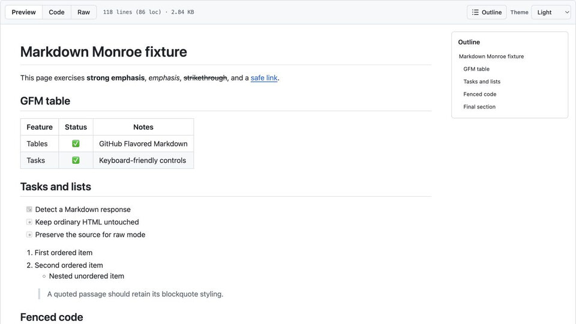
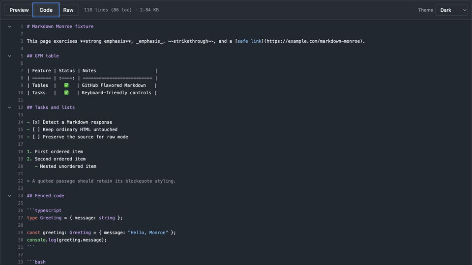

# Markdown Monroe

A clean, GitHub-style Markdown viewer for Chrome.

## Features

- GitHub Flavored Markdown (headings, links, emphasis, tables, task lists, strikethrough, blockquotes, lists, and fenced code)
- Syntax highlighting in fenced code blocks
- Preview, Code, and Raw views, with line numbers and collapsible heading sections in Code
- Toggleable, keyboard-operable Outline that becomes a drawer on narrow screens
- Light, dark, and auto (system) themes with a persisted browser-local preference
- Unsafe HTML is sanitized before it reaches the viewer

## Screenshots


*Preview mode with GitHub-flavored Markdown and the document Outline.*


*Dark Code mode with line numbers, syntax highlighting, and collapsible headings.*

Markdown Monroe runs as a content script on all pages but only replaces a response when its MIME type is Markdown (`text/markdown`, `text/x-markdown`, or the corresponding `application/*` types). `text/plain` responses are replaced only when the body is a plain-text document containing recognizable Markdown syntax. Normal HTML documents are left alone.

### Planned features

- Copy markdown to clipboard
- Copy fenced copy block contents to clipboard
- Handy keyboard shortcuts 

## Development

Bun is the required runtime and package manager. The repository intentionally contains `bun.lock` and no npm lockfile.

```sh
bun install
bun run check
bun run verify:fixtures
bun run build
bun run package
```

`bun run build` creates the unpacked extension in the ignored `dist/` directory. `bun run package` rebuilds it and creates `release/markdown-monroe-vX.Y.Z.zip`; generated builds and release artifacts are not committed.

For repeatable browser checks, start the local fixture server:

```sh
bun run fixtures
```

It serves the fixtures at `http://localhost:4173/`:

- `/markdown.md` — representative GFM, headings, links, emphasis, tables, tasks, strikethrough, blockquotes, lists, and fenced code
- `/unsafe.md` — malformed code and unsafe HTML/URL input
- `/plain.txt` — Markdown-shaped `text/plain` detection
- `/ordinary.html` — ordinary HTML that must remain untouched

## Install

Markdown Monroe currently supports Chrome. Both installation paths use Chrome's **Load unpacked** flow.

### Download a release

1. Download `markdown-monroe-vX.Y.Z.zip` from the [latest GitHub release](https://github.com/nbbaier/markdown-monroe/releases/latest).
2. Extract the ZIP.
3. Open `chrome://extensions` and enable **Developer mode**.
4. Choose **Load unpacked** and select the extracted directory.

### Build from source

```sh
git clone https://github.com/nbbaier/markdown-monroe.git
cd markdown-monroe
bun install --frozen-lockfile
bun run build
```

Then open `chrome://extensions`, enable **Developer mode**, choose **Load unpacked**, and select the repository's `dist/` directory.

Open the fixture links in Chrome and verify detection, rendered GFM, Outline navigation and toggle, Preview/Code/Raw switching, Code folding, syntax highlighting, and all three theme choices. Reload after choosing a theme to verify that the theme persists while the view resets to Preview with the Outline open. Also open `/ordinary.html` to confirm it is not replaced and `/unsafe.md` to confirm scripts, event handlers, and unsafe URL schemes do not execute.

`bun run verify:fixtures` uses JSDOM to exercise the detector and sanitizer in Bun. When headed Chrome is launched with a DevTools port, the repeatable Chrome smoke check can be run with `bun run smoke:chrome` (set `MARKDOWN_MONROE_CDP_PORT` and `MARKDOWN_MONROE_FIXTURE_ORIGIN` when they differ from `9222` and `http://127.0.0.1:4174`).

## Notes and limitations

- Firefox and other browsers are intentionally unsupported for now. Cross-browser support will require explicit browser-specific packaging and acceptance testing rather than relying on a shared manifest.
- The detector intentionally does not replace arbitrary `text/plain` paragraphs because doing so would make ordinary plain-text pages surprising. Such responses need Markdown-shaped syntax or a Markdown MIME type.
- Markdown parsing is provided by Marked with GFM enabled. Sanitization removes raw executable/embedded HTML; intentionally unsafe or unusual raw HTML may therefore render differently from the source.

## Releases

Maintainers publish a versioned ZIP and checksum with the manual GitHub Actions release workflow. See [the release guide](docs/releasing.md) for the exact process.

## Verification status

The repository has been verified with `bun install --frozen-lockfile`, `bun run check`, `bun run verify:fixtures`, `bun run build`, packaging, fixture response checks, Manifest V3 asset checks, and ZIP integrity checks. The interactive checklist above still requires a headed Chrome session with the unpacked extension loaded. The installed branded Chrome build in this environment ignores command-line extension-loading flags, so those browser interactions are intentionally unclaimed here.
